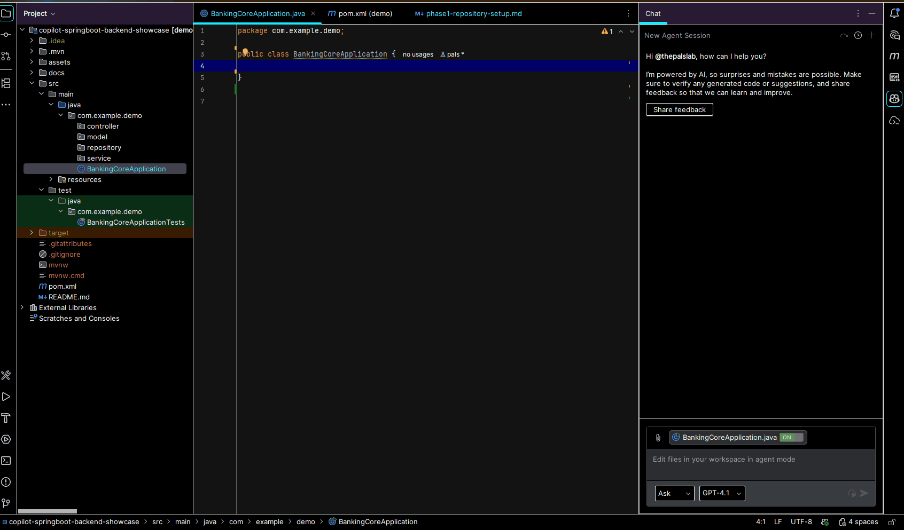

# 🧠 copilot-springboot-backend-showcase

### Learn how to use **GitHub Copilot** effectively in a **Spring Boot backend** environment.

---

## 🚀 What This Project Is

This repository is not a typical codebase — it’s a **guided learning environment**.  
You’ll use **GitHub Copilot** to generate, review, and refine a **real backend system**, one step at a time.

Copilot becomes your AI pair programmer.  
You provide **clear intent** (through comments and prompts).  
Copilot generates **code, tests, configs, and refactors** — and you learn how to **direct it effectively**.

---

## 🧩 What You’ll Learn

| Learning Block | Focus | Example Copilot Prompt |
|----------------|--------|------------------------|
| **1. Fundamentals** | How Copilot reads context, imports, and comments. | `// Create a REST controller for tasks` |
| **2. From Requirement to Code** | Translating requirements into controller/service/repository layers. | `// Create controller, service, and repository for fund transfer with rollback` |
| **3. Reading Code** | Ask Copilot to summarize or trace variables. | `Explain how 'taskRepository' is used in this class` |
| **4. Testing** | Generating JUnit and Mockito test scaffolds. | `// Generate unit test for FundTransferService with mocks` |
| **5. Refactoring** | Simplifying methods and improving readability. | `// Refactor this logic to be smaller and cleaner` |
| **6. Debugging** | Using Copilot to interpret errors or stack traces. | `Analyze this NullPointerException and suggest likely cause` |
| **7. Prompt Engineering** | Crafting prompts that control context and intent. | `// As a reviewer, what can be improved here?` |
| **8. Deployment Setup** | Using Copilot to generate YAML, Dockerfile, and Azure configs. | `// Write a Dockerfile for deploying this Spring Boot app` |
| **9. Reflection** | Reviewing and documenting Copilot behavior. | `// Summarize what Copilot did well in this file` |

Each topic builds on the last — from **prompting for code** → **verifying output** → **deploying results**.

---

## Prompt Files
- [phase1-repository-setup.md](docs/prompts/phase1-repository-setup.md)  
  
---
- [phase2-domain-and-data-layer.md](docs/prompts/phase2-domain-and-data-layer.md)  
  
---
- [phase3-service-layer.md](docs/prompts/phase3-service-layer.md)  
  
---
- [phase4-api-layer.md](docs/prompts/phase4-api-layer.md)  
  
---
- [phase5-infrastructure-and-crosscutting.md](docs/prompts/phase5-infrastructure-and-crosscutting.md)  
  
---
- [phase6-async-and-scheduling.md](docs/prompts/phase6-async-and-scheduling.md)  
---
- [phase7-testing-and-quality-assurance.md](docs/prompts/phase7-testing-and-quality-assurance.md)  
  
---
- [phase8-code-comprehension-and-improvement.md](docs/prompts/phase8-code-comprehension-and-improvement.md)  
---
- [phase9-prompt-engineering-and-reflection.md](docs/prompts/phase9-prompt-engineering-and-reflection.md)  

## 📘 Real-World Use Case

The example backend used across this repo is a **Retail Banking Mini-Core: Customer Fund Transfer System**.

It includes features like customer management, fund transfers, transaction logs, fraud checks, and reporting.

👉 Read more details here:  
[**docs/usecase-customer-fund-transfer.md**](docs/usecase-customer-fund-transfer.md)

